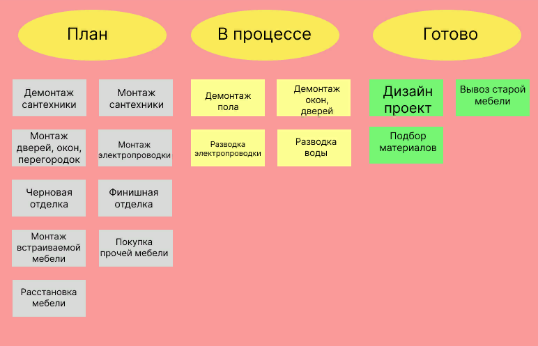

# Гибкие методологии (Agile, SCRUM, Канбан и другие) 

**Практическое задание. Урок 3. Scrum**

***У вас есть трёхкомнатная квартира, в которой не было ремонта последние 20 лет. Вместе с друзьями вы хотите сделать в ней современный ремонт, выстроив работу по Scrum.***

1. Опишите, как вы организуете работу над проектом по фреймворку Scrum.
2. Сформируйте Product Backlog.
3. Разделите все работы на спринты.
4. Сформируйте Sprint Backlog одного любого спринта.
5. Нарисуйте Scrum-доску и покажите на ней, как организована работа над задачами этого спринта.

**Решение**

Заказчик формирует Product Backlog по приоритетности выполнения ремонтных работ:

1. Определение общей стилистики квартиры, подготовка дизайн-проекта каждой из комнат
2. Определение стоимости выполнения работ и стройматериалов, наем квалифицированных рабочих и закупка необходимых строительных и отделочных материалов
3. Создание и утверждение плана размещения и привязки осветительного оборудования, плана взаимодействия осветительного оборудования и выключателей, плана размещения электроустановочного оборудования и слаботочных сетей, схема привязки сантехнического оборудования
4. Демонтаж всего, что необходимо заменить в ходе ремонта (стены, старая ванна, дверные коробки с дверями, пол, окна и т.п.)
5. Монтаж коммуникаций (электрическая проводка, трубы), замена окон и радиаторов отопления, установка вентиляции и т.п.
6. Возведение перегородок, закладка дверных проемов
7. Штукатурка и выравнивание полов, монтаж перегородок, коробов
8. Чистовая отделка: укладка паркета и плитки, шпатлевка, грунтовка, покраска стен
9. Чистовая сантехника (подсоединение ванны, раковины, стиральной машины, унитаза, установка смесителей и душевых леек), электрика (установка розеток и освещения), плинтуса, двери, наличники, карнизы
10. Итоговая проверка результата работ и финишная уборка помещения

**Спринты:**

*1 спринт:* Определение общей стилистики квартиры, подготовка дизайн-проекта каждой из комнат. Создание и утверждение плана размещения и привязки осветительного оборудования, плана взаимодействия осветительного оборудования и выключателей, плана размещения электроустановочного оборудования и слаботочных сетей, схема привязки сантехнического оборудования.

*2 спринт:* Определение стоимости выполнения работ и стройматериалов, наем квалифицированных рабочих и закупка необходимых строительных и отделочных материалов.

*3 спринт:* Демонтаж всего, что необходимо заменить в ходе ремонта (стены, старая ванна, дверные коробки с дверями, пол, окна и т.п.).

*4 спринт:* Монтаж коммуникаций (электрическая проводка, трубы).

**Sprint Backlog:**

- Установка систем водоотведения у ванны, раковины, стиральной машины
- Подвод горячей и холодной воды
- Установка заглушек в сантехнике
- Подведение электричества ко всем розеткам
- Вывод проводов в подрозетники
- Установка электрощитка
- Составление описания автоматов в электрощите.

*5 спринт:* Замена окон и радиаторов отопления, установка вентиляции и т.п. Возведение перегородок, закладка дверных проемов. Штукатурка и выравнивание полов, монтаж перегородок, коробов.

*6 спринт:* Чистовая отделка: укладка паркета и плитки, шпатлевка, грунтовка, покраска стен. Чистовая сантехника (подсоединение ванны, раковины, стиральной машины, унитаза, установка смесителей и душевых леек), электрика (установка розеток и освещения), плинтуса, двери, наличники, карнизы. Уборка.

